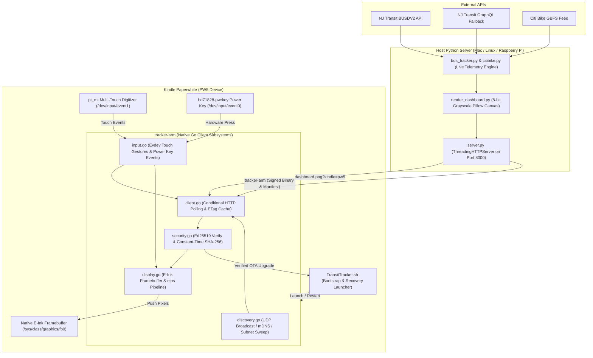

# Hoboken Transit Tracker (E-Ink Dashboard & Kindle Client)

A real-time transit arrival and dock dashboard for Hoboken, NJ, tracking:
- **NJ Transit Route 126** NYC-bound buses at Washington St & 9th St (`#20512`) and Clinton St & 9th St (`#20494`).
- **Citi Bike** live dock & e-bike availability at nearby stations (Clinton & 9th, Washington & 11th, Willow & 12th, Washington & 8th, Clinton & 7th, Grand & 6th).

Built for low-power e-ink wall displays and jailbroken Amazon Kindle devices (tested on Kindle Paperwhite 5 / PW5).

---

## Architecture Overview



The application version is defined once in [`VERSION`](VERSION). The Python
server and Citi Bike user agent read it directly; the Go client receives it at
build time via `-ldflags "-X main.Version=..."`.

---

## Detailed Documentation

Comprehensive technical documentation is organized in the [`docs/`](docs/) directory:

- **[Architecture & System Design](docs/architecture.md)**: Multi-tier topology, dual-redundancy arrival engine, native resolution rendering, schedule governor, and fleet management.
- **[Security Specification & Cryptographic Model](docs/security.md)**: Ed25519 root trust chain, signed OTA manifests, server certificates, constant-time verification, and CSP.
- **[HTTP API & Protocol Reference](docs/api.md)**: Complete endpoint reference, query parameters, request/response headers, and control plane commands.
- **[Hardware & Kindle Paperwhite Guide](docs/hardware_kindle.md)**: PW5 hardware details, jailbreak prerequisites, evdev touch mapping, power key handling, and e-ink framebuffer pipeline.
- **[Developer Guide & Quality Verification](docs/development.md)**: Makefile reference, static analysis linters, test suites, coverage gates, and signed release builds.

---

## Features

- **Dual-Redundancy Arrival Engine:** Primary polling against NJ Transit DepartureVision (BUSDV2) with instant automatic fallback to public GraphQL API. Upstream failures are surfaced distinctly from a genuine "no buses" state.
- **Citi Bike Dock Telemetry:** Live tracking of nearby Citi Bike docks with real-time e-bike availability prioritization.
- **Native Kindle Paperwhite 5 Support:** Standalone statically linked Go ARM client running in memory (`/tmp/tracker`). The client reports its true framebuffer size (`/sys/class/graphics/fb0/virtual_size`) so the server renders the dashboard **natively at panel resolution** (e.g. 1648×1236 landscape for the PW5) instead of upscaling an 800px bitmap — text is rasterized crisply and the server only rotates (never resamples) to the portrait framebuffer.
- **Touch Gestures:**
  - **Bottom button bar:** `BUSES`, `CITI BIKE`, `LIGHT`, `REFRESH`, `EXIT` tactile buttons along the bottom edge.
  - **Bottom-Left Corner Tap:** Cycles views between Citi Bike and NJ Transit Bus departures (outside the button bar).
  - **Single Tap Anywhere:** Cycles frontlight brightness (**Off** $\rightarrow$ **Cozy 8** $\rightarrow$ **Bright 18** $\rightarrow$ **Off**) instantly without flickering the e-ink screen.
  - **Double Tap Anywhere (< 380ms):** Clean exit back to the Kindle Library / Home booklet.
  - **Hardware Power Button:** Clean exit to Kindle Library.
  - **Top-Right Corner Tap:** Instant exit shortcut.
  - **Top-Left Corner Tap:** Immediate arrival refresh shortcut.
- **Scheduled Commute Dimming:** A fixed schedule (not solar calculation) adjusts frontlight brightness and warmth during the peak Hoboken commute windows (Morning 7:30–9:30 AM, Evening 4:30–7:00 PM). Manual tap overrides hold for 45 minutes.
- **Battery Telemetry & Indicator:** Real-time hardware battery percentage and charging state (`⚡`) queried directly via Kindle `lipc` and displayed in the top header and footer status bar.
- **LAN Auto-Discovery (Zero-Config):** Automatically discovers the running server across the local network via UDP broadcast (`TRANSIT_TRACKER_DISCOVER` on port 8001) and a /24 subnet sweep. Only loopback/link-local/private addresses are auto-adopted. `BUS_TRACKER_*` legacy probes are still accepted for older clients.
- **Wireless Over-The-Air (OTA) Hot-Reloading:** The Kindle polls the server and automatically self-updates its running Go binary in RAM via `syscall.Exec` when a new build is available. Downloads are verified against the server's `X-Tracker-SHA256` header before execution. The update check is folded into the dashboard response (no separate per-cycle request); a new binary is only downloaded when the advertised version differs.
- **Low-Power Polling:** The client makes a **single conditional request per cycle**. The server advertises its version + binary digest on the dashboard response so the OTA decision needs no extra request, and returns `304 Not Modified` (via `ETag`/`If-None-Match`) when the dashboard is byte-identical — so an unchanged screen costs neither the ~90 KB transfer nor the `eips` refresh. HTTP/1.1 keep-alive lets consecutive requests reuse one TCP connection. Diagnostics are delivered by a single queued sender instead of one goroutine (and radio wake) per log line.
- **Local Fallback Mode:** Caches the last valid binary and offline notification if the server is unreachable.

---

## Setup & Usage

### Option A: Docker Compose (Recommended for Home Servers / Raspberry Pi)

Run the server 24/7 as an appliance with automatic restarts on reboot:

```bash
# 1. Clone repository
git clone https://github.com/mike10010100/transit-tracker.git
cd transit-tracker

# 2. (Optional) Configure NJ Transit credentials
cp .env.example .env
chmod 600 .env
# Edit .env with your credentials if desired (NJT_BASE_URL defaults to https://pcsdata.njtransit.com)

# 3. Start in background
docker compose up -d
```

`network_mode: host` is enabled in `docker-compose.yml`, which lets the container seamlessly broadcast mDNS service records and respond to Kindle UDP discovery packets without NAT hurdles.

### Option B: Local Python Server

```bash
pip install -r requirements.txt
cp .env.example .env
chmod 600 .env
python server/server.py
```
- **Web UI (Auto-reloading):** `http://localhost:8000`
- **Kindle Image Endpoint:** `http://<SERVER_IP>:8000/dashboard.png?kindle=pw5`

### Control Endpoints

State-mutating control plane operations (`POST /stop`, `POST /resume`, `POST /mode`, `POST /action`, `POST /diag/request`) and query endpoints (`GET /devices`, `GET /mode`, `GET /action`, `GET /diag`) require authentication via the `X-Tracker-Token` header:

```bash
export TRACKER_CONTROL_TOKEN=my-secret
curl -X POST -H "X-Tracker-Token: my-secret" http://<SERVER_IP>:8000/stop
```

- **Zero-Bypass Policy:** There is no loopback or private IP bypass; every control request requires the token. Query parameter tokens are rejected to prevent leakage in logs or referrers.
- **Automatic Token Generation:** If `TRACKER_CONTROL_TOKEN` is unset in the environment, the server generates a cryptographically secure random 256-bit hex token (stored with `0600` permissions in the cache directory) and logs it on startup.
- **Web Interface:** The web management UI stores the token in browser `localStorage` and sends it via fetch headers; the token is never rendered into the HTML document.

---

## Kindle Paperwhite Setup

1. Copy `client-go/launcher/TransitTracker.sh` to your Kindle's `documents/` directory:
   ```bash
   cp client-go/launcher/TransitTracker.sh /Volumes/Kindle/documents/
   ```
2. In your Kindle Library, tap **"Transit Tracker"**.
   - **Auto-Discovery:** The Go client automatically scans your Wi-Fi network via UDP broadcast, locates the running server, and cryptographically verifies its identity before persisting the URL.
   - **Self-Updating Launcher:** The launcher script automatically self-updates itself from the Go binary's embedded release if updated.
   - *(Optional Manual Override)*: You can force a specific server address by creating `/Volumes/Kindle/documents/tracker_server.txt` containing your server URL (e.g. `http://192.168.1.100:8000`).

---

## Security Model & Signed OTA Releases

The project employs an end-to-end cryptographic trust chain built on **Ed25519** signatures:

1. **Release Key:** `make keygen` generates an Ed25519 release signing key (`secrets/ota_ed25519.key`, mode `0600`).
2. **Client Pinning:** The public release key is baked into the Go client at compile time (`-X main.OTAPublicKey=...`).
3. **Signed OTA Manifests:** `tracker-arm.manifest.json` specifies the version, binary SHA-256, and byte size, signed by the release key. The client verifies the signature, hash, and strict semver progression before executing updates.
4. **Server Identity Certificates:** The server possesses an Ed25519 identity key certified by the release key (`server_identity.cert.json`).
5. **Authenticated Responses:** Dashboard responses (`/dashboard.png`) and discovery endpoints (`/identity`) include cryptographic nonce signatures. The Kindle validates the signature against the server certificate and release key before rendering or adopting configurations.

### Building the Go Client & Releases

To generate a key and compile a signed release:
```bash
make keygen   # Generate release key in secrets/ota_ed25519.key (run once)
make build    # Cross-compiles tracker-arm, signs manifest, and mints server cert
make verify-release # Validates manifest and binary against public key
```

For development builds without OTA signing:
```bash
ALLOW_UNSIGNED=1 make build
```

The CLI tool `client-go/cmd/otasign` provides stdlib-only utilities for key generation, public key extraction, manifest signing, server cert minting, and signature verification.

---

## Development & Verification Suite

Install the development dependencies:
```bash
pip install -r requirements-dev.txt
```

Run the verification suite:
```bash
make check       # Complete pipeline: fmt-check, lint, test, audit, coverage gates
make test        # Run all test suites: Go (-race), Python (unittest), and Shell integration
make lint        # Run all linters: Go (vet/golangci-lint), Python (mypy/ruff), Shell (shellcheck)
make fmt         # Format all codebases: Go (gofmt -s) and Python (ruff format)
make fmt-check   # Check formatting without modifying files
make audit       # Run vulnerability scanning (govulncheck and pip-audit)
make coverage    # Enforce coverage gates across Go and Python stacks
```

### Test Coverage & Standards

Both stacks enforce strict coverage gates and static analysis in CI and `make check`:

| Stack  | Static Analysis & Linters | Verification Tool / Framework | Gate | Current |
|--------|---------------------------|-------------------------------|------|---------|
| Go     | `go vet`, `golangci-lint` | `go test -v -race`            | 93%  | 93.5%   |
| Python | `ruff`, `mypy` (strict)   | `coverage.py` (`pyproject.toml`) | 92% | 95.0%   |
| Shell  | `shellcheck` (strict)     | `tests/test_launcher.sh` (8/8 integration) | 100% | 100% |
| Docker | `hadolint`                | Container smoke test          | -    | Pass    |

- **Go gate:** `scripts/check_coverage_go.sh 93` (covers `client-go`, `cmd/otasign`, and `internal/otasig`).
- **Python gate:** `--fail-under=92` in `pyproject.toml` (evaluates branch coverage across all 17 modules).
- **Race Safety:** All Go unit tests run cleanly with `-race` with zero data races.
- **Hermetic Testing:** Tests isolate runtime environments, filesystem access, and network interfaces using dedicated test seams.

---

## License

MIT License. See [LICENSE](LICENSE) for details.
