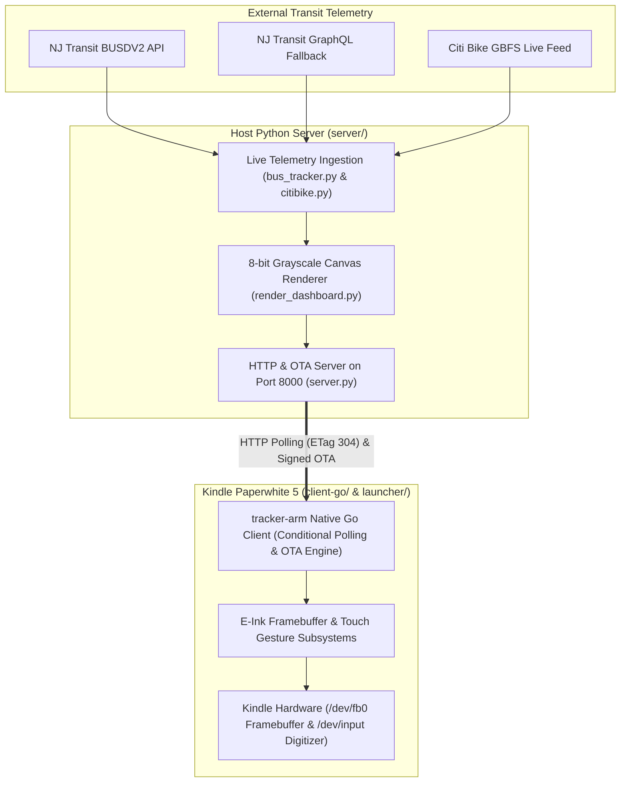

# Hoboken Transit Tracker (E-Ink Dashboard & Kindle Client)

A real-time transit and micro-mobility dashboard for Hoboken, NJ, tracking:
- **NJ Transit Route 126** NYC-bound buses at Washington St & 9th St (`#20512`) and Clinton St & 9th St (`#20494`).
- **Citi Bike** live dock & e-bike availability at nearby stations (Clinton & 9th, Washington & 11th, Willow & 12th, Washington & 8th, Clinton & 7th, Grand & 6th).

Built for low-power e-ink wall displays, jailbroken Amazon Kindle devices (Kindle Paperwhite 5 / PW5), and any modern web browser.

---

## ⚡ Quick Start (< 2 Minutes)

You can run the server immediately on any Linux, macOS, or Raspberry Pi machine:

### Option A: Docker Compose (Recommended)

```bash
# 1. Clone the repository
git clone https://github.com/mike10010100/transit-tracker.git
cd transit-tracker

# 2. (Optional) Copy environment template
cp .env.example .env
chmod 600 .env

# 3. Start the server
docker compose up -d
```

### Option B: Local Python Server

```bash
# 1. Install dependencies
pip install -r requirements.txt

# 2. Start the server
python server/server.py
```

### View in Your Browser

Once started, open these URLs in your web browser:
- **Live Web Dashboard & Schedule Manager**: [`http://localhost:8000`](http://localhost:8000)
- **Rendered Kindle E-Ink Image**: [`http://localhost:8000/dashboard.png?kindle=pw5`](http://localhost:8000/dashboard.png?kindle=pw5)
- **Health Check**: [`http://localhost:8000/healthz`](http://localhost:8000/healthz)

---

## 🧭 Dashboard Views & User Interface

The dashboard automatically optimizes its layout based on the time of day:

```
+-------------------------------------------------------------------------+
| HOBOKEN TRANSIT TRACKER               BATTERY: 87% [⚡]   UPDATED: 08:15 |
+------------------------------------+------------------------------------+
|  CITI BIKE DOCKS (MORNING HERO)    |  NJ TRANSIT ROUTE 126 BUSES        |
|  Clinton & 9th St:  12 bikes [6 ⚡] |  Washington & 9th: 3 min, 11 min   |
|  Washington & 11th:  8 bikes [4 ⚡] |  Clinton & 9th:    6 min, 18 min   |
|  Willow & 12th:      4 bikes [2 ⚡] |  Status: Normal Service            |
+------------------------------------+------------------------------------+
| [BUSES]    [CITI BIKE]    [LIGHT]    [REFRESH]    [EXIT]  | Phase: Peak |
+-------------------------------------------------------------------------+
```

- **☀️ Morning View (5:00 AM – 12:00 PM)**: Prioritizes Citi Bike dock availability and e-bike counts for the morning commute into Manhattan.
- **🌙 Evening View (12:00 PM – 5:00 AM)**: Prioritizes NJ Transit Route 126 departures with real-time ETA predictions.
- **🔄 Auto-Switching**: The server selects the appropriate view automatically, or you can switch manually via the touch screen or web interface.

---

## 📱 Kindle Paperwhite 5 Setup

Turn any jailbroken Kindle Paperwhite 5 into an ultra-low-power, wall-mounted transit monitor:

1. **Connect Kindle to your computer over USB**.
2. **Copy the launcher script**:
   ```bash
   cp client-go/launcher/TransitTracker.sh /Volumes/Kindle/documents/
   ```
3. **Safely eject the Kindle**, go to your Library, and tap **"Transit Tracker"**.

### Zero-Configuration Discovery
The Kindle client automatically scans your local Wi-Fi network via UDP broadcast and `/24` subnet sweeps, verifies the server's cryptographic identity, and starts polling without manual IP configuration.

*(Optional manual override: Create `/Volumes/Kindle/documents/tracker_server.txt` containing your server URL, e.g. `http://192.168.1.100:8000`.)*

> [!TIP]
> For complete Kindle jailbreak prerequisites, hardware evdev mapping, and low-power configuration, see the **[Hardware & Kindle Paperwhite Guide](docs/hardware_kindle.md)**.

---

## 👆 Touch Controls & Hardware Gestures

When running on a Kindle Paperwhite, the following physical and touch interactions are available:

| Input / Gesture | Location | Action |
|---|---|---|
| **BUSES** | Bottom button bar | Switches to Route 126 Bus departures view. |
| **CITI BIKE** | Bottom button bar | Switches to Citi Bike availability view. |
| **LIGHT** | Bottom button bar | Cycles frontlight: **Off (0)** $\rightarrow$ **Cozy (8)** $\rightarrow$ **Bright (18)** $\rightarrow$ **Off (0)**. |
| **REFRESH** | Bottom button bar | Forces an immediate arrival refresh. |
| **EXIT** | Bottom button bar | Cleanly exits back to the Kindle Home screen. |
| **Single Tap** | Anywhere on screen | Wakes interaction session; keeps frontlight on. |
| **Double Tap** | Anywhere (< 380ms) | Quick exit back to Kindle Home. |
| **Power Button** | Hardware button | Wakes dormant screen; clean exit if already interactive. |
| **Top-Left Tap** | Top-left corner | Immediate arrival refresh shortcut. |
| **Top-Right Tap** | Top-right corner | Immediate exit shortcut. |

---

## ⏱️ Schedule & Power Management

The dashboard uses a declarative state machine to conserve energy throughout the day:

- **Peak Phases (Morning 7:30–9:30 AM, Evening 4:30–7:00 PM)**: Fast 60-second polling cadence, interactive display, and cozy frontlight illumination.
- **Off-Peak Phase**: Relaxed 10-minute polling interval with frontlight turned off.
- **Overnight Phase (10:00 PM – 6:00 AM)**: Low-power deep sleep with 60-minute polling. The Kindle suspends to RAM with hardware RTC wakealarms clamped to the morning wake boundary.

### Customizing the Schedule
The schedule is fully customizable via `config/schedule.json` or directly in the browser at `http://localhost:8000`:
- **Web UI Editor**: View the next 24 hours of transitions, toggle fast-poll mode, or edit and validate schedule JSON live.
- **Hot-Reloading**: Changes to `config/schedule.json` are applied automatically without restarting the server.
- See the [Schedule State Machine Documentation](docs/architecture.md#23-schedule-state-machine-serverstate_machinepy-serverschedulepy) for syntax and examples.

---

## 🏗️ Architecture Overview



- **Dual-Redundancy Arrival Engine**: Primary queries use NJ Transit DepartureVision BUSDV2, with instantaneous fallback to NJ Transit GraphQL and static GTFS schedule caches if upstream APIs stall.
- **Native Resolution Rasterization**: Renders directly at the Kindle PW5's native 1648×1236 panel resolution with crisp subpixel typography rather than upscaling low-resolution bitmaps.
- **Zero-Transfer 304 Not Modified**: Conditional HTTP requests (`ETag` / `If-None-Match`) ensure the e-ink screen is only refreshed when transit data actually changes.
- **Zero External Go Dependencies**: The Kindle client is built using 100% Go standard library for minimal footprint, memory safety, and maximum stability on embedded Linux.

---

## 🔒 Security & Cryptographic Trust

- **Ed25519 Root of Trust**: All Over-The-Air (OTA) binary updates are cryptographically signed using an Ed25519 release key (`secrets/ota_ed25519.key`).
- **Compile-Time Pinning**: The public key is baked into the Go client binary at compile time. Untrusted or unsigned updates are rejected.
- **Authenticated Responses**: Dashboard responses include an `X-Tracker-Auth` signature header that Kindle clients verify before rendering.
- **Zero-Bypass Control Security**: Administrative endpoints (`POST /schedule`, `POST /action`, `POST /mode`) strictly require an `X-Tracker-Token` header.
- For complete security details, see the **[Security Specification & Cryptographic Model](docs/security.md)**.

---

## 📚 Technical Documentation Index

For in-depth guides and system specifications, explore the [`docs/`](docs/) directory:

| Document | Focus & Audience | Key Contents |
|---|---|---|
| **[Documentation Hub](docs/README.md)** | All Users & Developers | Complete onboarding guide, troubleshooting FAQ, and topic index. |
| **[Architecture & Design](docs/architecture.md)** | Systems Engineers | Multi-tier topology, arrival engine fallback, schedule state machine, and fleet registry. |
| **[Hardware & Kindle Guide](docs/hardware_kindle.md)** | Kindle Users & Deployers | PW5 specifications, jailbreak guide, evdev mapping, and power management. |
| **[HTTP API & Protocol](docs/api.md)** | Integrators & Developers | Full endpoint reference, query parameters, header specifications, and payload examples. |
| **[Security Specification](docs/security.md)** | Security Auditors | Ed25519 trust chain, OTA manifest verification, authenticated responses, and CSP. |
| **[Developer Guide](docs/development.md)** | Contributors & Maintainers | Build instructions, test suites, coverage gates, and CI/CD pipelines. |

---

## 🛠️ Developer Verification & Testing

Verify code quality across all stacks with the unified Makefile:

```bash
# 1. Install development dependencies
pip install -r requirements-dev.txt

# 2. Run the complete quality verification pipeline
make check

# Or run individual verification suites:
make fmt-check    # Check Go and Python formatting
make lint         # Run all linters (go vet, mypy, ruff, shellcheck)
make test         # Run all unit tests (Go -race, Python unittest, Shell)
make coverage     # Enforce coverage gates (Go >= 93%, Python >= 92%)
```

### Coverage & Verification Status
- **Go Client**: `93.5%` statement coverage (gate: `93%`, tested with `-race`).
- **Python Server**: `94.0%+` branch coverage across 414 tests in 18 modules (gate: `92%`).
- **Shell Launcher**: `10/10` end-to-end integration tests passing with ShellCheck compliance.

---

## 📄 License

This project is open-source under the [MIT License](LICENSE).
