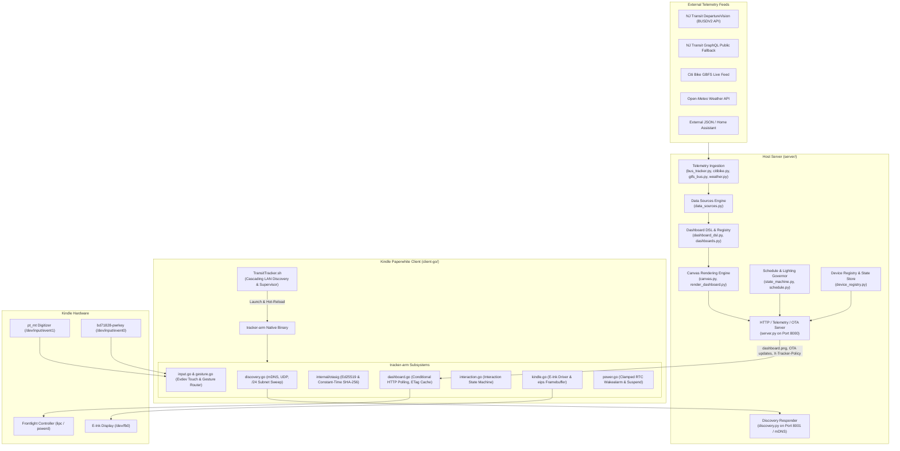
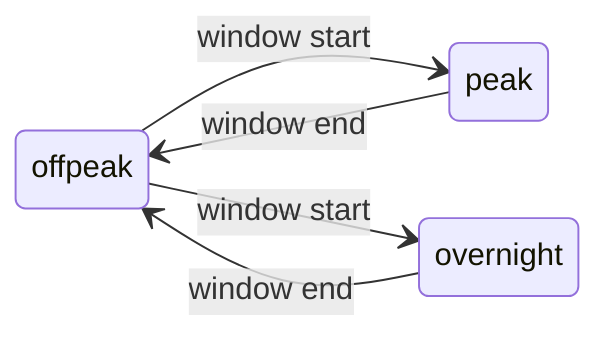
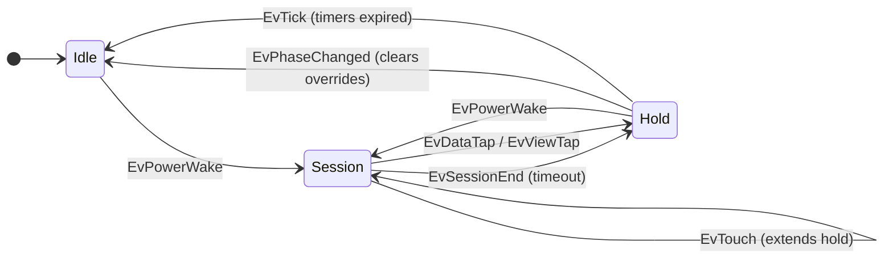

# Architecture & System Design

The **Hoboken Transit Tracker** is a multi-tier system engineered to deliver real-time transit and micro-mobility telemetry to ultra-low-power e-ink displays (specifically jailbroken Amazon Kindle Paperwhite devices) and web browsers with minimal energy consumption and cryptographic verification.

---

## 1. System Topology



---

## 2. Server Architecture (`server/`)

The server runs on standard Linux/macOS hosts, home servers, or Raspberry Pis using Python 3.11+.

### 2.1 Dual-Redundancy Arrival Engine
- **Primary Source**: `NJTransitBusTracker` queries the NJ Transit DepartureVision BUSDV2 XML endpoint for Route 126 arrivals at designated stop IDs (`#20512` at Washington & 9th; `#20494` at Clinton & 9th).
- **Secondary Fallback**: If BUSDV2 encounters network timeouts, schema changes, or HTTP errors, the tracker automatically falls back to NJ Transit's public GraphQL endpoint without interrupting the client.
- **GTFS Bus Tracker**: `GTFSBusTracker` (`server/gtfs_bus.py`) indexes static GTFS timetables with GTFS-RT protocol buffers to compute ETA predictions even when primary feeds are impaired.
- **Citi Bike Telemetry**: `CitiBikeTracker` (`server/citibike.py`) consumes public GBFS JSON feeds for live station availability and prioritizes e-bikes and open docks across 6 key neighborhood hubs.
- **Meteorology Telemetry**: `WeatherTracker` (`server/weather.py`) fetches real-time temperature, conditions, humidity, precipitation probability, and daily forecasts from Open-Meteo (zero API keys required) with TTL caching and fallback mock snapshots.

### 2.2 Dynamic Layout & Resolution Engine
- **Resolution-Native Rendering**: The server renders images at the client's native panel resolution (e.g. 1648×1236 for Kindle Paperwhite 5) rather than upscaling an 800px bitmap. Text and vector glyphs are rendered with subpixel font metrics directly to the target canvas.
- **Morning vs. Evening Hero Views**:
  - `morning` (5:00 AM – 12:00 PM): Hero presentation focused on Citi Bike availability for the morning NYC commute.
  - `evening` (12:00 PM – 5:00 AM): Hero presentation prioritizing Route 126 inbound/outbound bus departures.
  - `auto`: Automatically selects the optimal view based on current local time.
- **`ScaledDraw` Proxy**: Located in `server/canvas.py`, wraps Pillow's `ImageDraw` to scale coordinates, bounding boxes, and font sizes linearly according to the requested display scale.

### 2.3 Modular Dashboard Architecture & Layout DSL (`server/dashboard_dsl.py`, `server/dashboards.py`, `server/data_sources.py`)
- **Declarative Layout Engine**: Provides flexbox-inspired vertical (`VStack`), horizontal (`HStack`), and styled container (`Box`) primitives with recursive coordinate computation and bounded canvas rendering.
- **Universal & Transit Component Library**:
  - `HeaderWidget`: Status badges, title, subtitle, clock, date, and live battery indicator.
  - `MetricCardWidget`: Highlighted single-metric cards with large bold numbers, units, and sub-labels.
  - `EntityListWidget`: Multi-row tabular status lists for transit stations, sensor entities, or bus routes.
  - `TextNoticeWidget`: Framed announcement, advisory, or sleep notice banners.
  - `ButtonBarWidget`: Interactive bottom button bars displaying active and available views.
  - `WeatherHeroWidget` & `WeatherForecastWidget`: Current weather conditions, highs/lows, precipitation, and multi-day forecast strip.
  - `BusHeroWidget` & `BusBarWidget`: Route 126 arrival countdown and compact departure bars.
  - `CitiBikeHeroWidget` & `CitiBikeBarWidget`: Citi Bike dock/e-bike availability cards and bars.
- **Pluggable Data Source Engine**:
  - `SystemDataSource`: Clock, battery percentage, charging state.
  - `NJTransitDataSource`: Live bus arrivals across designated stops.
  - `CitiBikeDataSource`: Dock and bike availability across neighborhood stations.
  - `WeatherDataSource`: Local conditions and multi-day forecasts.
  - `StaticDataSource`: Fixed key-value metrics.
  - `HttpJsonDataSource`: Queries arbitrary external JSON endpoints (e.g. Home Assistant, IoT sensors, webhook relays) with `${ENV_VAR}` header expansion, TTL caching, and JSONPath extraction (`path="attributes.temperature"`).
- **Dashboard Registry & Hot-Reloading**:
  - Built-in presets: `morning`, `evening`, `weather`, `bus_focus`, `citibike_focus`.
  - User-configurable layouts stored in `config/dashboards/<id>.json`.
  - Hot-reloaded on disk modification without daemon restarts.

### 2.4 Schedule State Machine (`server/state_machine.py`, `server/schedule.py`)

The schedule is a configurable two-layer state machine. The server owns **layer 1**, the time-driven *phase*. The client owns **layer 2**, the event-driven *interaction overlay* (`idle` $\rightarrow$ `session` $\rightarrow$ `hold`). Its timeouts are configured on the server and shipped in the signed `X-Tracker-Policy` header.



Each phase sets everything required to drive presentation and power management:

| Phase key | Meaning | `peak` | `offpeak` | `overnight` |
|---|---|---|---|---|
| `poll_interval` | `X-Kindle-Poll-Interval` (30–7200 s) | 60 | 600 | 3600 |
| `presentation` | `interactive` / `idle` / `dormant` | interactive | idle | dormant |
| `status_note` | Bottom-strip text for non-interactive faces; `{until}` is replaced with phase end | – | "PRESS POWER…" | "SLEEPING — back at {until}…" |
| `lighting` | Frontlight `brightness` / `warmth` (0–24) | 8 / 12 | 0 / 0 | 0 / 0 |
| `realtime` | Allow GTFS-RT / live feeds (else static schedule only) | ✓ | ✓ | ✗ |
| `suspend` | Client may deep-suspend to RAM between polls | ✗ | ✓ | ✓ |
| `view` | Default view for this phase (`morning`, `evening`, `weather`, etc.) | `morning` | `evening` | `weather` |
| `views` | Tuple of view IDs available for manual touch cycling | – | – | `weather`, `evening` |
| `interaction_view`| View mode to display when woken by power button or touch | `morning` | `evening` | `morning` |

**Windows** select the active phase. They are evaluated **in order and the first match wins**. `days` defaults to every day. A window with `start > end` wraps past midnight and belongs to the day it *starts* on. Outside every window, `default_phase` applies. A window may also set `view` or `views`, which client polling and touch cycles then use.

**Web Dashboard & Schedule Management**:
- The web UI at `GET /` includes an interactive schedule editor with live phase status, remaining countdown to next transition, and a 24-hour timeline.
- Changes can be saved via `POST /schedule` with atomic persistence to `SCHEDULE_CONFIG` (`config/schedule.json`).
- If mounted in a read-only container, `ConfigStore` automatically falls back to `CACHE_DIR/schedule.json` to guarantee resilient configuration saves.
- Hot-reloading: `schedule.json` is re-read automatically when its mtime changes.

**Signed Policy Header**:
Clients receive phase directives, overlay timeouts, and view mode lists in the signed `X-Tracker-Policy` response header:
```http
X-Tracker-Policy: v=1;phase=peak;until=1760103000;suspend=0;session=90;fast=600;hold=2700;sl=8,12;views=weather,morning,evening
```

### 2.5 Multi-Device Fleet Registry (`server/device_registry.py`)
- **Auto-Registration**: Any incoming request containing `X-Tracker-Client-ID` is automatically registered without prior manual provisioning.
- **Isolated Per-Device State**:
  - Telemetry: IP address, battery percentage, charging state, client version, firmware version, and last-seen timestamp.
  - Command Queues: Isolated queues for `X-Tracker-Action` (e.g. `restart`, `reboot`, `update`) and `X-Tracker-Diag` (`quick`, `full`).
  - Storage: Per-device diagnostic logs and dumps stored under `<cache_dir>/devices/<client_id>/`.

---

## 3. Client Architecture (`client-go/`)

The Kindle client is a statically linked Go binary compiled for Linux ARMv7 (`CGO_ENABLED=0 GOOS=linux GOARCH=arm GOARM=7`) with zero external third-party Go dependencies.

### 3.1 Subsystems Breakdown

| Subsystem | Source File | Responsibility |
|---|---|---|
| **Discovery** | `client-go/discovery.go` | Implements LAN autodiscovery via mDNS, UDP broadcast (`TRANSIT_TRACKER_DISCOVER` on port 8001), and `/24` subnet sweeps. Rejects non-private or public addresses. |
| **HTTP Engine** | `client-go/dashboard.go` | Manages conditional polling loop (`If-None-Match` / `ETag`), keep-alive connections, exponential backoff, response auth verification, and header injection. |
| **Security** | `client-go/internal/otasig` | Implements Ed25519 response signature verification (`transit-tracker-resp-v2` with `v1` fallback), server identity certificate validation, and manifest checks. |
| **Input Driver** | `client-go/input.go` | Asynchronously reads Linux evdev input streams (`/dev/input/event1` touch, `/dev/input/event0` power key). Decodes event boundaries. |
| **Gesture Router** | `client-go/gesture.go` | Translates raw evdev coordinates into semantic gestures: single tap, double tap (< 380ms), and bottom button bar zones. |
| **Interaction Overlay** | `client-go/interaction.go` | Implements client-owned interaction overlay (`idle -> session -> hold`), policy parsing, timeout tracking, and fast-poll holds. |
| **Power Management** | `client-go/power.go` | Controls low-power sleep loops, Wi-Fi radio toggling, RTC wakealarm programming clamped to phase boundaries, and suspend-to-RAM (`/sys/power/state`). |
| **Display & Lighting** | `client-go/kindle.go` | Framebuffer geometry detection, Amazon UI suspension, eips rendering, and frontlight intensity/warmth cycling. |
| **Device Identity** | `client-go/client_id.go` | Queries hardware serial number via `lipc`, with fallback to hidden persistent dotfile `/mnt/us/documents/.tracker_client_id.txt`. |
| **Battery Telemetry**| `client-go/battery.go` | Queries battery level and charging status via `lipc` with bounded timeouts. |
| **Diagnostics** | `client-go/diagnostics.go` | Generates diagnostic bundles (`dmesg`, `lipc`, meminfo, process table) upon server request. |
| **Batched Logging** | `client-go/client_log.go` | Queues and streams diagnostic logs to the server without waking the radio per line. |
| **OTA Supervisor** | `client-go/dashboard.go` | Detects new versions advertised by the server, validates the signed manifest against the embedded release key, writes to disk, and replaces running process via `syscall.Exec`. |

### 3.2 Client Identification
The Go client establishes identity in `client-go/client_id.go`:
1. Queries Kindle hardware serial via `lipc-get-prop com.lab126.system serialNumber`.
2. Falls back to a persistent RFC 4122 v4 UUID in `/mnt/us/documents/.tracker_client_id.txt` (stored as a hidden dotfile so the Kindle document indexer does not treat it as an ebook, with automatic migration from legacy unhidden paths).
3. Attaches `X-Tracker-Client-ID: <id>` to every HTTP communication.

### 3.3 Interaction Overlay & Low-Power Sleep Machine
The client runs an event-driven interaction overlay that coordinates user input with the server's schedule policy:



1. **Overlay States**:
   - **`idle`**: The server's phase settings apply unchanged.
   - **`session`**: Active user interaction. Requests `present=interactive`, keeps device awake, lights panel to `session_lighting`, and resets session timer on every touch.
   - **`hold`**: Manual view and frontlight choices persist, and resident-mode polling stays at fast cadence for `fast_poll_hold`. In low-power suspend mode, this does not keep the device awake. Phase transitions immediately reset `hold` to `idle` to avoid leaking manual choices across phases (e.g. overnight).
2. **Boundary-Clamped RTC Wakes**:
   - In low-power sleep mode (`client-go/power.go`), when the device suspends to RAM, the RTC alarm is clamped to `min(interval, until - now)`.
   - This ensures the device wakes promptly when a schedule phase transitions (e.g., at the start of a morning commute peak) rather than oversleeping through phase changes.
   - If the phase boundary is closer than `minSuspendInterval` (120s), the device stays awake on wall-clock sleep instead of incurring suspend/resume latency.

---

## 4. Bootstrap Launcher (`client-go/launcher/TransitTracker.sh`)

A POSIX-compliant shell script that acts as the supervisor on the Kindle device:
1. **Network Initialization**: Waits for Wi-Fi interface connectivity (`wlan0`).
2. **Cascading LAN Discovery**:
   - Tier 1: Probes `transit-tracker.local:8000` via mDNS.
   - Tier 2: Queries the default gateway IP from `/proc/net/route` on port 8000.
   - Tier 3: Executes a parallel `/24` subnet sweep probing `/healthz` and `/identity`.
3. **Atomic Persistence**: Persists discovered server URL to `/mnt/us/documents/tracker_server.txt`.
4. **Binary Bootstrap & Recovery**: Downloads `tracker-arm`, validates the ELF magic bytes (`\x7fELF`), maintains a verified backup copy, and invokes the binary. If a new binary fails, it rolls back automatically to the backup copy.
