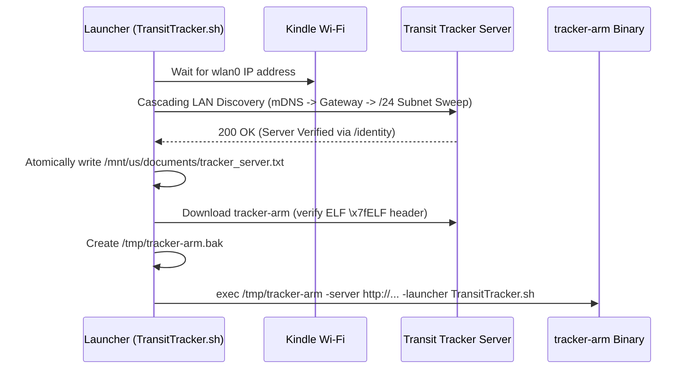

# Hardware & Kindle Paperwhite Guide

This guide covers deployment, hardware interfacing, gesture controls, and display management on jailbroken Amazon Kindle devices, focusing on the **Kindle Paperwhite 5 (PW5, 11th Generation)**.

---

## 1. Hardware Specifications

| Specification | Kindle Paperwhite 5 (PW5) | Standard Kindle (PW3 / PW4) |
|---|---|---|
| **SoC Architecture** | NXP i.MX7Dual (ARM Cortex-A7, 32-bit ARMv7) | NXP i.MX6SoloLite / i.MX6SLL |
| **Panel Size** | 6.8" E-Ink Carta 1200 | 6.0" E-Ink Carta |
| **Panel Resolution**| 1236 × 1648 (Portrait) / 1648 × 1236 (Landscape) | 1072 × 1448 or 600 × 800 |
| **Pixel Density** | 300 PPI | 212–300 PPI |
| **Digitizer** | FocalTech `pt_mt` Multi-Touch (`/dev/input/event1`) | Neonode zForce IR or Synaptics |
| **Power Key** | ROHM BD71828 PMIC Key (`/dev/input/event0`) | GPIO / PMIC Key (`/dev/input/event0`) |
| **Frontlight** | 17 LEDs (White + Amber Warmth) via `lipc` | Single White Channel |
| **OS Environment** | Custom Linux 4.9.x kernel with Lab126 userland | Linux 3.x / 4.x |

---

## 2. Jailbreak Prerequisites

Before deploying to a Kindle Paperwhite:
1. **Software Jailbreak**: The Kindle must have a working jailbreak (e.g. **LanguageBreak** or **WinterBreak** for FW 5.14.x–5.16.x).
2. **Developer Keys**: Hotfix/developer keystores must be installed to allow shell scripts to execute from the user documents partition.
3. **Local Wi-Fi**: The Kindle must be connected to the same Wi-Fi network or VLAN as the Transit Tracker server.

---

## 3. Installation via Launcher Script

The bootstrap script [`client-go/launcher/TransitTracker.sh`](file:///home/mike10010100/git/transit-tracker/client-go/launcher/TransitTracker.sh) provides zero-touch onboarding:

1. **Connect the Kindle to your computer over USB**.
2. **Copy the launcher script** to the documents directory:
   ```bash
   cp client-go/launcher/TransitTracker.sh /Volumes/Kindle/documents/
   ```
3. **Safely eject the Kindle** from your computer.
4. **Tap the new "Transit Tracker" booklet** in your Kindle Library.

### 3.1 First-Run Boot Sequence


---

## 4. Touch Gestures & Button Zones

The Go client directly decodes raw evdev input events from `/dev/input/event1` (`pt_mt` digitizer).

### 4.1 On-Screen Tactile Button Bar
Along the bottom edge of the landscape display, five distinct touch zones are mapped:

| Button | Action | Behavior |
|---|---|---|
| **BUSES** | Switch View | Activates Route 126 NJ Transit Bus departures view. |
| **CITI BIKE** | Switch View | Activates Citi Bike dock & e-bike availability view. |
| **LIGHT** | Frontlight Cycle | Toggles frontlight: **Off (0)** $\rightarrow$ **Cozy (8)** $\rightarrow$ **Bright (18)** $\rightarrow$ **Off (0)**. |
| **REFRESH** | Immediate Fetch | Bypasses remaining poll countdown and forces an immediate arrival update. |
| **EXIT** | Clean Exit | Restores standard Kindle Framework (`lipc-set-prop com.lab126.appmgrd start app://com.lab126.booklet.home`). |

### 4.2 Corner & Surface Gestures
Outside the bottom button bar:
- **Single Tap Anywhere**: Wakes or extends the current viewing session; holds the frontlight without flickering the screen.
- **Double Tap Anywhere (< 380ms)**: Quick exit shortcut back to Kindle Home.
- **Top-Left Corner Tap**: Immediate arrival refresh shortcut.
- **Top-Right Corner Tap**: Instant exit shortcut.
- **Bottom-Left Corner Tap**: Cycles views between Citi Bike and Bus departures.

### 4.3 Hardware Power Button
Pressing the physical Kindle power button generates `KEY_POWER` (`116`) events on `/dev/input/event0`:
- **When Screen is Dormant/Off**: Wakes the SoC and starts an interactive viewing session with frontlight illumination.
- **When Running Interactive**: Gracefully exits the application back to the Kindle Home booklet.

---

## 5. Frontlight & Power Management

### 5.1 Hardware Lipc Commands
The Go client communicates with the Kindle power daemon (`powerd`) over the Lab126 Inter-Process Communication bus (`lipc`):

```bash
# Query current battery percentage
lipc-get-prop com.lab126.powerd battLevel

# Query charging state (1 = charging, 0 = discharging)
lipc-get-prop com.lab126.powerd isCharging

# Set frontlight intensity (0 to 24)
lipc-set-prop com.lab126.powerd flIntensity 8

# Set frontlight color warmth (0 = pure white, 24 = deep amber)
lipc-set-prop com.lab126.powerd flWarmth 12
```

### 5.2 Battery Protection & Timeouts
All calls to `lipc` in the client are bounded with a 2-second timeout. If `powerd` stalls or deadlocks after an OS sleep resume, the input dispatcher automatically recovers rather than freezing touch interaction.

### 5.3 Client Identifier Storage
The client stores its persistent identifier in `/mnt/us/documents/.tracker_client_id.txt` as a hidden dotfile. This prevents the Kindle library indexing service from treating the identifier file as an ebook on the home screen.

---

## 6. E-Ink Framebuffer Pipeline

1. **Resolution Detection**: The client reads `/sys/class/graphics/fb0/virtual_size` to determine native panel dimensions.
2. **Server-Side Native Rendering**: The server renders images at the exact pixel geometry (1648×1236 landscape) and transposes coordinates to portrait before delivery.
3. **Hardware Waveform Ingestion**:
   - The client invokes the Kindle native binary `/usr/sbin/eips`:
     ```bash
     /usr/sbin/eips -g /tmp/dashboard.png
     ```
   - Hardware waveform controllers drive the micro-capsules directly, preventing ghosting while avoiding slow full-screen flashing.

---

## 7. Troubleshooting & FAQ

### The Kindle cannot locate the server automatically
If UDP discovery fails (e.g. your Wi-Fi router blocks multicast or clients are on separate subnets):
1. Connect the Kindle over USB.
2. Create a text file at `/Volumes/Kindle/documents/tracker_server.txt`.
3. Put your server's exact IP and port on a single line:
   ```text
   http://192.168.1.100:8000
   ```
4. Eject the Kindle and tap "Transit Tracker" again.

### The screen does not refresh every minute
This is intentional! The client uses conditional HTTP requests (`ETag` / `If-None-Match`). If transit arrivals and Citi Bike dock counts have not changed, the server returns `304 Not Modified`. The e-ink display does not refresh, saving battery and screen life.

### How do I exit Transit Tracker?
- Tap the **EXIT** button on the bottom right of the screen.
- Or **double-tap** anywhere on the screen within 380ms.
- Or press the physical **power button** once.
- The Kindle will immediately return to your normal book library.
