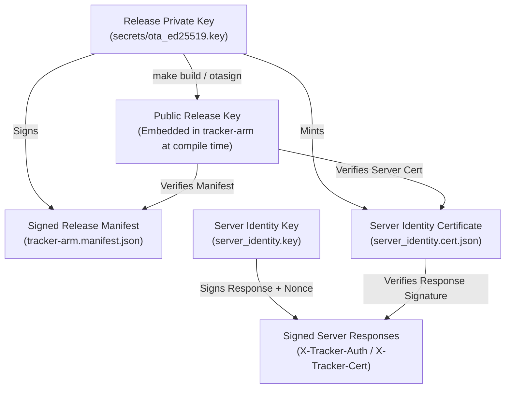

# Security Specification & Cryptographic Model

The **Hoboken Transit Tracker** implements an end-to-end cryptographic trust architecture to safeguard devices from rogue firmware injection, unauthorized control operations, network eavesdropping/tampering, and timing attacks.

---

## 1. Cryptographic Trust Chain

The security model anchors all trust in a single **Root Release Key** using the **Ed25519** digital signature algorithm.



### 1.1 Root Release Key
- **Algorithm**: Ed25519 (pure Edwards-curve Digital Signature Algorithm).
- **Generation**: Created via `make keygen` or `client-go/cmd/otasign keygen -out secrets/ota_ed25519.key`.
- **Permissions**: Mode `0600`, stored strictly on the operator host and excluded from git and Docker builds via `.gitignore` and `.dockerignore`.
- **Compile-Time Pinning**: When building the Go client, `Makefile` embeds the public key directly into the binary:
  ```bash
  -ldflags="-X main.OTAPublicKey=<hex-or-base64-pubkey>"
  ```

---

## 2. Over-The-Air (OTA) Release Verification

Devices will only update themselves if a release is cryptographically proven to originate from the possessor of the release key.

### 2.1 Manifest Structure (`tracker-arm.manifest.json`)
```json
{
  "version": "1.35.5",
  "sha256": "0109ef3df247a368977e1d8fcb307788578ae3b7a7c2edd1b1642fc6f9fa5429",
  "size": 6750370,
  "signature": "<base64-ed25519-signature>"
}
```

### 2.2 Verification Rules
Before executing `syscall.Exec` on a downloaded binary, the client verifies:
1. **Signature Validity**: The Ed25519 signature verifies the canonical JSON payload using the embedded `OTAPublicKey`.
2. **Strict Semver Progression**: The advertised version must be strictly greater than the currently running version (prevents downgrade attacks).
3. **Exact Digest Match**: The SHA-256 digest of the downloaded file is verified using constant-time comparison against `sha256`.
4. **Byte Size Check**: The binary length must match `size` exactly (prevents payload truncation or streaming exhaustion).

---

## 3. Server Identity & Authenticated Responses

To prevent malicious LAN devices from spoofing transit data or sending bogus control commands, server responses are authenticated.

### 3.1 Server Identity Certificate (`server_identity.cert.json`)
The server certificate is minted during `make build` and signed by the root release key:
```json
{
  "public_key": "<server-ed25519-public-key>",
  "issuer": "transit-tracker-release",
  "issued_at": 1791653581,
  "signature": "<root-signed-certificate-signature>"
}
```

### 3.2 Nonce Challenge & Anti-Replay
1. The client generates a cryptographically random 16-byte hex nonce:
   ```http
   X-Tracker-Nonce: a1b2c3d4e5f6...
   ```
2. The server signs the response headers, body digest, and the client nonce using its `server_identity.key`:
   ```http
   X-Tracker-Auth: <base64-response-signature>
   X-Tracker-Cert: <escaped-server-identity-cert-json>
   ```
3. The client verifies:
   - That `server_identity.cert.json` is signed by the embedded `OTAPublicKey`.
   - That the signature on the response headers/body/nonce is valid for the server's public key.
   - If verification fails, the response is discarded and the display remains untouched.

### 3.3 Signed Response Format
The signed message (`transit-tracker-resp-v2`) covers a fixed, ordered list of 13 headers. A header that is absent is still signed, as an empty `name=` line.

| Format (first line of the message) | Signed headers |
|---|---|
| `transit-tracker-resp-v2` | `etag`, `x-kindle-poll-interval`, `x-tracker-presentation`, `x-tracker-mode`, `x-tracker-action`, `x-tracker-diag`, `x-kindle-brightness`, `x-kindle-warmth`, `x-tracker-version`, `x-tracker-sha256`, `x-resolved-view`, `x-tracker-view`, `x-tracker-policy` |

- `X-Tracker-Policy` is included directly in the response signature alongside all other presentation and control headers.
- Shared test vectors are in `client-go/internal/otasig/testdata/vectors.json` (`response`).

---

## 4. Constant-Time Timing Attack Defenses

Standard string equality checks (`==` or `strings.EqualFold`) terminate on the first mismatched byte, creating timing side-channels that can allow attackers to guess HMAC digests or SHA-256 hashes byte-by-byte.

- **Go Client**: In `client-go/security.go`, `VerifySHA256` decodes hex digests into raw byte slices and compares them using `crypto/subtle.ConstantTimeCompare`:
  ```go
  func VerifySHA256(expectedHex, actualHex string) bool {
      exp, err1 := hex.DecodeString(strings.TrimSpace(expectedHex))
      act, err2 := hex.DecodeString(strings.TrimSpace(actualHex))
      if err1 != nil || err2 != nil || len(exp) == 0 || len(act) == 0 {
          return false
      }
      return subtle.ConstantTimeCompare(exp, act) == 1
  }
  ```
- **Python Server**: In `server/server.py`, control token checks utilize `hmac.compare_digest` to prevent token timing analysis.

---

## 5. Control Plane Authentication & Web UI Hardening

State-mutating endpoints (`/stop`, `/resume`, `/mode`, `/action`, `/diag/request`) require authentication.

### 5.1 Zero-Bypass Policy
- **Header Authentication**: Requests must include the secret token via `X-Tracker-Token: <token>`.
- **No Loopback / Private Bypass**: Localhost and local LAN requests are treated with the exact same security rigor as external requests.
- **No Query Parameter Tokens**: Tokens in URL query parameters (`?token=...`) are explicitly forbidden to prevent disclosure in server logs, proxy access logs, and HTTP `Referer` headers.
- **Automatic Token Generation**: If `TRACKER_CONTROL_TOKEN` is unset in the environment, the server generates a cryptographically secure 256-bit random hex token (via `secrets.token_hex(16)`), saves it with mode `0600` in the cache directory, and logs it once at startup.

### 5.2 Content Security Policy (CSP) & Web Sanitization
- The Web UI at `GET /` serves a strict Content Security Policy with a unique per-request cryptographic nonce:
  ```http
  Content-Security-Policy: default-src 'self'; script-src 'nonce-<nonce>'; style-src 'unsafe-inline'; img-src 'self' data:; connect-src 'self'
  ```
- All client IDs, firmware versions, IP addresses, and battery reports are escaped with `html.escape` before injection into the HTML document.
- The control token is stored in the browser's `localStorage` and sent exclusively in the `X-Tracker-Token` HTTP header via `fetch()`. The token is never written into the DOM.

---

## 6. Network Discovery Filtering

The auto-discovery engine prevents rogue redirection to public internet addresses:
- **Private Subnet Enforcement**: Only loopback (`127.0.0.0/8`, `::1`), RFC 1918 private IPv4 addresses (`10.0.0.0/8`, `172.16.0.0/12`, `192.168.0.0/16`), and link-local addresses (`169.254.0.0/16`) are adopted.
- Public IPs returned by spoofed discovery packets or rogue gateways are rejected immediately.

---

## 7. Container Least Privilege

The Docker production deployment enforces defense-in-depth:
- Runs as an unprivileged system user (`tracker:tracker`).
- Drops all root capabilities at startup using `setpriv --reuid=tracker --regid=tracker --init-groups`.
- Mounts secrets using BuildKit secret mounts (`--mount=type=secret,id=ota_signing_key`) ensuring private keys are never persisted into intermediate or final container layers.
